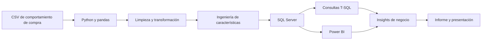

# Análisis del comportamiento de compra del cliente


Proyecto integral de **analítica descriptiva y diagnóstica** orientado a comprender el comportamiento de compra de los clientes. El flujo combina preparación de datos con Python, almacenamiento y análisis en SQL Server, y visualización interactiva en Power BI.

El análisis trabaja con **3,900 registros y 18 variables** relacionadas con datos demográficos, características de la compra, preferencias de producto, descuentos, suscripciones, frecuencia de compra y tipo de envío.

---

## Objetivo

Transformar datos de comportamiento de compra en información útil para:

- identificar patrones de gasto y consumo;
- segmentar clientes según su historial de compras;
- analizar preferencias de productos y categorías;
- evaluar el uso de descuentos y promociones;
- comparar clientes suscritos y no suscritos;
- apoyar decisiones de fidelización, marketing y gestión comercial.

---

## Flujo de trabajo



---

## Tecnologías utilizadas

| Tecnología | Uso en el proyecto |
|---|---|
| **Python** | Preparación, exploración y transformación de datos |
| **pandas** | Limpieza, imputación y creación de variables |
| **Jupyter Notebook** | Desarrollo documentado del proceso de análisis |
| **SQLAlchemy** | Creación del motor de conexión con SQL Server |
| **pyodbc** | Conectividad mediante el controlador ODBC |
| **SQL Server / T-SQL** | Almacenamiento y consultas analíticas |
| **Power BI** | Modelado, indicadores, segmentadores y visualización |
| **PowerPoint y Word** | Presentación ejecutiva y documentación final |

---

## Conjunto de datos

El conjunto analizado contiene:

| Característica | Valor |
|---|---:|
| Registros | 3,900 |
| Variables iniciales | 18 |
| Edad mínima | 18 años |
| Edad máxima | 70 años |
| Edad promedio | 44.07 años |
| Importe promedio de compra | USD 59.76 |
| Calificación promedio inicial | 3.75 |
| Valores faltantes | 37 |

### Variables principales

- **Demográficas:** edad, género y ubicación.
- **Compra:** artículo, categoría, importe, temporada, talla y color.
- **Comportamiento:** compras anteriores, frecuencia, calificación, descuento y método de pago.
- **Relación comercial:** estado de suscripción y tipo de envío.

> El notebook espera un archivo llamado `customer_shopping_behavior.csv`. Este archivo de origen no forma parte de los entregables analizados y debe agregarse al repositorio para garantizar la reproducción completa del flujo.

---

## Preparación de datos con Python

El notebook `proyecto.ipynb` desarrolla las siguientes etapas:

1. **Carga y exploración inicial** con `head()`, `info()` y `describe()`.
2. **Detección de valores faltantes**, identificando 37 nulos en `Review Rating`.
3. **Imputación por categoría**, utilizando la mediana de calificación de cada categoría de producto.
4. **Estandarización de nombres**, convirtiendo las columnas a minúsculas y formato `snake_case`.
5. **Ingeniería de características**, mediante:
   - creación de grupos de edad;
   - conversión de la frecuencia de compra a días;
   - eliminación de la variable redundante `promo_code_used`.
6. **Traducción de columnas al español** para su carga en la base de datos.
7. **Integración con SQL Server** mediante `SQLAlchemy` y `pyodbc`.
8. **Carga del DataFrame** en la tabla `cliente` de la base `ComportamientoDelCLiente`.

### Segmentación de edad

| Segmento | Intervalo |
|---|---|
| Menor de edad | 0–17 años |
| Joven | 18–35 años |
| Adulto | 36–60 años |
| Senior | 61–100 años |

### Conversión de frecuencia de compra

| Frecuencia | Equivalencia |
|---|---:|
| Weekly | 7 días |
| Fortnightly / Bi-Weekly | 14 días |
| Monthly | 30 días |
| Quarterly / Every 3 Months | 90 días |
| Annually | 365 días |

---

## Análisis con SQL

El archivo `SQLQuery.sql` contiene nueve consultas orientadas a preguntas de negocio:

1. Ingresos totales por género.
2. Clientes que utilizaron descuento y gastaron por encima del promedio.
3. Productos con mayor calificación promedio.
4. Comparación del importe medio entre envío estándar y exprés.
5. Gasto e ingresos de suscriptores frente a no suscriptores.
6. Productos con mayor dependencia de descuentos.
7. Segmentación de clientes en nuevos, recurrentes y leales.
8. Tres productos más comprados por categoría usando funciones de ventana.
9. Relación entre compradores recurrentes y estado de suscripción.

Las consultas utilizan elementos propios de **T-SQL**, como `TOP`, `CASE`, expresiones de tabla comunes (`WITH`) y `ROW_NUMBER()`.

---

## Principales resultados

### Indicadores generales

- **Ingresos totales analizados:** USD 233,081.
- **Importe promedio de compra:** USD 59.76.
- **Calificación promedio:** aproximadamente 3.75 sobre 5.

### Suscripciones

| Estado | Clientes | Gasto promedio | Ingreso total |
|---|---:|---:|---:|
| Suscrito | 1,053 | USD 59 | USD 62,645 |
| No suscrito | 2,847 | USD 59 | USD 170,436 |

El gasto promedio es prácticamente igual entre ambos grupos. La diferencia en ingresos totales se explica principalmente por la mayor cantidad de clientes no suscritos.

### Segmentación por historial de compras

| Segmento | Regla | Clientes | Participación |
|---|---|---:|---:|
| Nuevo | 1 compra anterior | 83 | 2.13% |
| Recurrente | 2–10 compras anteriores | 701 | 17.97% |
| Leal | Más de 10 compras anteriores | 3,116 | 79.90% |

### Productos mejor valorados

| Posición | Producto | Calificación promedio |
|---:|---|---:|
| 1 | Gloves | 3.86 |
| 2 | Sandals | 3.84 |
| 3 | Boots | 3.82 |
| 4 | Hat | 3.80 |
| 5 | Skirt | 3.78 |

### Dependencia de descuentos

Los artículos con mayor proporción de compras con descuento fueron **Hat, Sneakers, Coat, Sweater y Pants**, con tasas aproximadas entre 47% y 50%.

### Tipo de envío

- **Express:** importe medio cercano a USD 60.
- **Standard:** importe medio cercano a USD 58.

La diferencia observada es pequeña, por lo que conviene complementarla con análisis de volumen, margen y significancia estadística antes de tomar decisiones comerciales.

---

## Dashboard de Power BI

El archivo `Tablero_de_control.pbix` contiene una página interactiva con:

- número de clientes;
- importe promedio de compra;
- calificación promedio;
- distribución por estado de suscripción;
- monto y volumen por categoría;
- monto y volumen por grupo de edad;
- segmentadores por suscripción, género, categoría y tipo de envío.


> El archivo PBIX fue guardado con **Free Shipping** seleccionado en el segmentador de tipo de envío. Para visualizar los resultados globales, se debe limpiar esa selección.

---

## Estructura del repositorio

```text
.
├── README.md
├── proyecto.ipynb
├── SQLQuery.sql
├── Tablero_de_control.pbix
├── INFORME_FINAL_PROYECTO_TRANSVERSAL.docx
├── AnalisisdelComportamientodeCompradelCliente.pptx
├── customer_shopping_behavior.csv        # Archivo requerido
└── assets/
    └── dashboard.png
```

---

## Ejecución del proyecto

### 1. Clonar el repositorio

```bash
git clone <URL_DEL_REPOSITORIO>
cd <NOMBRE_DEL_REPOSITORIO>
```

### 2. Crear un entorno virtual

```bash
python -m venv .venv
```

En Windows:

```bash
.venv\Scripts\activate
```

En Linux o macOS:

```bash
source .venv/bin/activate
```

### 3. Instalar dependencias

```bash
pip install pandas sqlalchemy pyodbc jupyter
```

### 4. Preparar SQL Server

Crear la base de datos:

```sql
CREATE DATABASE ComportamientoDelCLiente;
```

El notebook carga el DataFrame en la tabla `cliente` utilizando `if_exists="replace"`.

### 5. Configurar la conexión

Actualizar en `proyecto.ipynb` el nombre del servidor:

```python
host = r"NOMBRE_DEL_EQUIPO\SQLEXPRESS"
database = "ComportamientoDelCLiente"
```

La configuración original utiliza:

```text
ODBC Driver 17 for SQL Server
Autenticación integrada de Windows
```

### 6. Ejecutar el notebook

```bash
jupyter notebook proyecto.ipynb
```

### 7. Ejecutar las consultas

Abrir `SQLQuery.sql` en SQL Server Management Studio y ejecutar las consultas sobre la tabla `cliente`.

### 8. Abrir el dashboard

Abrir `Tablero_de_control.pbix` en Power BI Desktop, actualizar la fuente de datos y limpiar los filtros guardados cuando se requiera una vista general.

---

## Consideraciones técnicas

Antes de publicar o ejecutar el proyecto completo, se recomienda revisar los siguientes puntos:

1. **Estandarizar el nombre del campo de importe.** El notebook y Power BI utilizan `monto_de_comprar`, mientras que algunas consultas SQL utilizan `monto_de_compre`. Debe adoptarse un único nombre en todo el flujo.
2. **Mantener SQL Server como motor oficial.** Aunque el informe menciona PostgreSQL en una sección, el notebook, el controlador ODBC y la sintaxis de las consultas corresponden a SQL Server/T-SQL.
3. **Corregir las medidas de volumen en Power BI.** Para contar ventas o registros debe utilizarse `COUNT`, `DISTINCTCOUNT` o `COUNTROWS`, no la suma de `idcliente`.
4. **Eliminar valores dependientes del equipo.** El nombre del servidor SQL está escrito directamente en el notebook y debe parametrizarse.
5. **Documentar la fuente y licencia del dataset.** El repositorio debe indicar el origen, fecha de consulta y condiciones de uso de los datos.
6. **Interpretar las consultas como análisis descriptivo.** El proyecto no implementa actualmente un modelo de aprendizaje automático ni analítica predictiva.

---

## Recomendaciones de negocio

- Diseñar beneficios más claros para aumentar la adopción de suscripciones.
- Crear programas de fidelización dirigidos a compradores recurrentes.
- Evaluar el impacto de los descuentos sobre el margen, no solo sobre el volumen.
- Priorizar productos con alta valoración en campañas y recomendaciones.
- Personalizar acciones comerciales por grupo de edad, categoría y tipo de envío.
- Analizar tasas y promedios normalizados antes de comparar segmentos con tamaños diferentes.

---

## Mejoras futuras

- Incorporar un archivo `requirements.txt`.
- Crear un diccionario de datos.
- Añadir validaciones automáticas de calidad.
- Parametrizar la conexión a SQL Server mediante variables de entorno.
- Crear medidas DAX explícitas y una tabla exclusiva de medidas.
- Añadir análisis RFM o clustering para una segmentación más robusta.
- Implementar un modelo predictivo de propensión a la suscripción.
- Publicar capturas adicionales y una versión PDF del dashboard.

---

## Entregables

| Archivo | Contenido |
|---|---|
| `proyecto.ipynb` | Limpieza, transformación e integración con SQL Server |
| `SQLQuery.sql` | Consultas analíticas de negocio |
| `Tablero_de_control.pbix` | Dashboard interactivo en Power BI |
| `INFORME_FINAL_PROYECTO_TRANSVERSAL.docx` | Informe metodológico y resultados |
| `AnalisisdelComportamientodeCompradelCliente.pptx` | Presentación ejecutiva del proyecto |

---

## Autor

**Erik Gutierrez**

Proyecto desarrollado como ejercicio transversal de análisis de datos con Python, SQL Server y Power BI.
